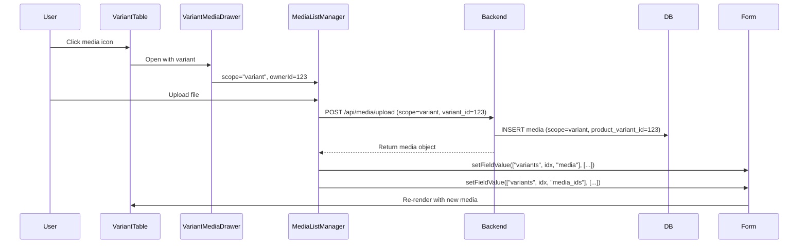
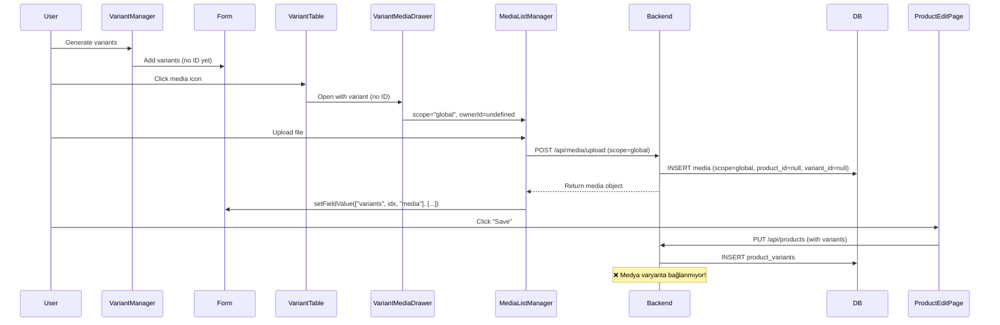

# Medya Sistemi ve Kütüphane - Varyant Medya Analiz Raporu

**Tarih:** 2026-02-08  
**Analiz Kapsamı:** Medya yönetim sistemi, kütüphane, varyant medya yönetimi

---

## 📋 İçindekiler

1. [Sistem Mimarisi](#sistem-mimarisi)
2. [Bileşen Analizi](#bileşen-analizi)
3. [Tespit Edilen Sorunlar](#tespit-edilen-sorunlar)
4. [Varyant Medya Akışı](#varyant-medya-akışı)
5. [Öneriler](#öneriler)

---

## 🏗️ Sistem Mimarisi

### Medya Scope Yapısı

Sistem 3 farklı scope ile çalışıyor:

```typescript
type MediaScope = "product" | "variant" | "global";
```

#### Scope Mantığı:
- **`global`**: Henüz bir ürün/varyanta bağlanmamış medya (orphan/draft)
- **`product`**: Ürüne bağlı medya
- **`variant`**: Varyanta bağlı medya

### Database Yapısı

```sql
media table:
- id (PK)
- disk (default: 'public')
- type ('image' | 'video' | 'file')
- path (unique file path)
- thumb_path (thumbnail/preview path)
- mime
- size
- width, height
- focal_x, focal_y (crop odak noktası)
- crop_x, crop_y, crop_w, crop_h (crop koordinatları)
- sha1
- original_name
- alt
- scope ('product' | 'variant' | 'global')
- product_id (nullable FK)
- product_variant_id (nullable FK)
- position (sıralama)
- created_by (user_id)
```

---

## 🧩 Bileşen Analizi

### Frontend Bileşenler

#### 1. **ProductMediaSection.tsx**
```typescript
Görev: Ürün edit sayfasında medya yönetimi
Kullanım: Product edit page
Scope: "global" (!)
```

**ÖNEMLİ BULGU:**
```typescript
// Line 46
<MediaManager
  scope="global"  // ← Edit modunda bile "global" kullanılıyor!
  items={items}
  onItemsChange={handleItemsChange}
/>
```

**Mantık:**
- Edit modunda bile yeni yüklemeler `global` (orphan) olarak yapılıyor
- "Kaydet" butonuna basılana kadar backend'de ürüne bağlanmıyorlar
- Kullanıcı "Vazgeç" derse, cleanup-draft kancası bu yeni yüklenenleri temizleyebiliyor

**Avantaj:** Draft medya yönetimi güvenli
**Dezavantaj:** Medya hemen ürüne bağlanmıyor, kaydet gerekiyor

---

#### 2. **VariantMediaDrawer.tsx**
```typescript
Görev: Varyant medya yönetimi drawer
Kullanım: VariantManager içinde açılır
Scope: variantId ? "variant" : "global"
```

**Medya Senkronizasyonu:**
```typescript
// Line 82-87
form?.setFieldValue?.(["variants", idx, "media"], next);
form?.setFieldValue?.(
  ["variants", idx, "media_ids"],
  (next ?? []).map((m: any) => Number(m.id)).filter(Boolean),
);

// AntD Form: nested array updates may not always trigger watchers/renders.
// Re-set the full array with a new reference to ensure VariantTable updates.
const current = (form?.getFieldValue?.(["variants"]) ?? []) as any[];
if (Array.isArray(current)) {
  form?.setFieldsValue?.({ variants: [...current] });
}
```

**SORUN TESPİTİ #1: Form State Senkronizasyonu**
- Nested array güncellemeleri AntD Form'da her zaman watcher'ları tetiklemiyor
- Workaround: Full array'i yeni referans ile set etme
- **Risk:** Performance overhead, gereksiz re-render'lar

---

#### 3. **MediaLibraryModal.tsx**
```typescript
Görev: Merkezi medya kütüphanesi
Özellikler:
- Pagination (36 item/page)
- Search (filename, alt, path)
- Filter (all, image, video)
- Upload
- Import Legacy
- Multi-select
- Preview
- Delete (sadece kullanılmayan medya)
```

**Kütüphane Mantığı:**
```typescript
// Backend'den unique path'ler getiriliyor
// Aynı dosya birden fazla yerde kullanılsa bile kütüphanede 1 kez görünüyor
query
  .orderBy('path')
  .orderByDesc('id')
  .distinct('path')
  .paginate(36);
```

**Video Desteği:**
```typescript
// Line 436-445
{item.type === 'video' || item.mime?.startsWith('video/') ? (
  <video
    src={url}
    muted
    playsInline
    loop={false}
    onMouseOver={e => e.currentTarget.play()}
    onMouseOut={e => { e.currentTarget.pause(); e.currentTarget.currentTime = 0; }}
  />
) : (
  
)}
```

**✅ İYİ UYGULAMA:** Hover'da video preview

---

#### 4. **MediaManager.tsx**
```typescript
Görev: Ana medya yönetim bileşeni
Özellikler:
- Drag & drop upload
- Sıralama (DnD)
- Crop (sadece image)
- Delete
- Kütüphaneden seç
- Concurrent upload (limit: 3)
```

**Concurrent Upload:**
```typescript
// Line 318-335
async function mapConcurrent<T, R>(
  items: T[],
  limit: number,
  mapper: (item: T, index: number) => Promise<R>,
): Promise<R[]> {
  const results: R[] = new Array(items.length);
  let cursor = 0;

  const workers = new Array(Math.max(1, Math.min(limit, items.length)))
    .fill(0)
    .map(async () => {
      while (cursor < items.length) {
        const index = cursor++;
        results[index] = await mapper(items[index], index);
      }
    });

  await Promise.all(workers);
  return results;
}
```

**✅ İYİ UYGULAMA:** 3 concurrent upload ile backend'i overload etmeden hızlı yükleme

**BroadcastChannel Sync:**
```typescript
// Line 271-299
bc = new BroadcastChannel("media-events");
bc.onmessage = (ev) => {
  const data = raw as { type?: unknown; media?: unknown; id?: unknown };
  if (data.type === "updated" && data.media) {
    applyExternalUpdate({ media: data.media as MediaItem });
  }
  if (data.type === "deleted") {
    const id = typeof data.id === "number" ? data.id : Number(data.id);
    if (Number.isFinite(id) && id > 0) applyExternalUpdate({ deleted_id: id });
  }
};
```

**SORUN TESPİTİ #2: BroadcastChannel Kullanımı**
- Medya editor'dan geri dönüldüğünde değişiklikleri senkronize etmek için kullanılıyor
- **Sorun:** BroadcastChannel tüm tarayıcılarda desteklenmiyor
- **Fallback:** sessionStorage kullanılıyor ama bu da tek sekmede çalışıyor

---

#### 5. **MediaListManager.tsx**
```typescript
Görev: Basit liste formatında medya yönetimi
Kullanım: VariantMediaDrawer içinde
Özellikler:
- Upload
- Reorder (DnD)
- Delete
```

**Reorder Endpoint:**
```typescript
// Line 219-228
const url =
  scope === "product"
    ? `/api/products/${ownerId}/media/reorder`
    : `/api/variants/${ownerId}/media/reorder`;

await apiFetch(url, {
  method: "PUT",
  json: { ids },
});
```

---

### Backend Analizi

#### MediaController.php

**Upload Endpoint:**
```php
// Line 125-215
public function upload(Request $request): JsonResponse
{
    // Validation
    $data = $request->validate([
        'scope' => ['nullable', 'in:product,variant,global'],
        'product_id' => ['nullable', 'integer', 'exists:products,id'],
        'product_variant_id' => ['nullable', 'integer', 'exists:product_variants,id'],
        'file' => ['required', 'file', 'max:51200'], // 50MB
    ]);

    // Default scope: 'global'
    $scope = $data['scope'] ?? 'global';

    // Video için thumb_path = path (video kendisi thumbnail olarak kullanılıyor)
    $thumbPath = null;
    if ($type === 'video') {
        $thumbPath = $path;
    }

    $media = Media::create([...]);

    // Image variants job (afterResponse)
    if ($shouldGenerate && $type === 'image') {
        GenerateMediaVariantsJob::dispatch($media->id)->afterResponse();
    }
    
    // Video thumbnail job (afterResponse)
    if ($type === 'video') {
        GenerateVideoThumbnailJob::dispatch($media->id)->afterResponse();
    }
}
```

**✅ İYİ UYGULAMA:**
- Job'lar `afterResponse()` ile çalıştırılıyor → Upload UX hızlı
- Video thumbnail generation background'da

**SORUN TESPİTİ #3: Video Thumbnail**
```php
// Line 174-176
if ($type === 'video') {
    $thumbPath = $path; // Use video as its own thumbnail for now
}
```
- Video'nun kendisi thumbnail olarak kullanılıyor
- `GenerateVideoThumbnailJob` dispatch ediliyor ama sonuç `thumb_path`'i güncelliyor mu?
- **Kontrol gerekli:** Job'un başarılı çalışıp çalışmadığı

---

**Library Endpoint:**
```php
// Line 304-344
public function library(Request $request): JsonResponse
{
    $query = Media::query()
        ->select('id', 'disk', 'scope', 'path', 'thumb_path', ...)
        ->whereNotNull('path');

    // Compute usage count
    $query->addSelect([
        'used_count' => Media::query()
            ->selectRaw('count(*)')
            ->whereColumn('disk', 'media.disk')
            ->whereColumn('path', 'media.path')
            ->where(function ($sub) {
                $sub->whereNotNull('product_id')
                    ->orWhereNotNull('product_variant_id');
            }),
    ]);

    // Latest unique paths
    $items = $query->orderBy('path')
        ->orderByDesc('id')
        ->distinct('path')
        ->paginate(36);
}
```

**✅ İYİ UYGULAMA:**
- `DISTINCT ON (path)` ile unique dosyalar
- `used_count` subquery ile kullanım sayısı
- Kullanılmayan medya silinebiliyor

---

**attachFromLibrary Endpoint:**
```php
// Line 441-466
public function attachFromLibrary(Request $request): JsonResponse
{
    $sourceItems = Media::whereIn('id', $data['media_ids'])->get();
    $newItems = [];

    foreach ($sourceItems as $source) {
        $newMedia = $source->replicate();
        // Reset relations for the "cloned" version
        $newMedia->scope = 'global';
        $newMedia->product_id = null;
        $newMedia->product_variant_id = null;
        $newMedia->created_by = $request->user()?->id;
        $newMedia->save();
        
        $newItems[] = $newMedia;
    }

    return response()->json(['items' => $newItems], 201);
}
```

**SORUN TESPİTİ #4: Medya Klonlama**
- Kütüphaneden seçilen medya `replicate()` ile klonlanıyor
- **Sorun:** Aynı dosya (path) için yeni DB row oluşturuluyor
- **Sonuç:** Disk'te 1 dosya, DB'de N row
- **Avantaj:** Her kullanım için ayrı crop/focal point
- **Dezavantaj:** DB bloat, cleanup karmaşık

**Alternatif Yaklaşım:**
- Pivot table kullanılabilir: `product_media`, `variant_media`
- Aynı media row birden fazla yerde kullanılabilir
- Crop/focal point media row'da değil, pivot'ta saklanabilir

---

## 🐛 Tespit Edilen Sorunlar

### 1. **Form State Senkronizasyonu (VariantMediaDrawer)**

**Sorun:**
```typescript
// Nested array updates may not always trigger watchers/renders
form?.setFieldsValue?.({ variants: [...current] });
```

**Etki:**
- Varyant medya değişiklikleri bazen UI'da görünmüyor
- Full array clone gerekiyor → Performance overhead

**Çözüm Önerisi:**
- `useWatch` hook'u ile spesifik path'leri izle
- `form.setFieldValue` yerine `form.setFields` kullan
- Debounce ekle

---

### 2. **BroadcastChannel Browser Desteği**

**Sorun:**
```typescript
bc = new BroadcastChannel("media-events");
```

**Etki:**
- Safari < 15.4'te çalışmıyor
- Firefox private mode'da çalışmıyor

**Çözüm Önerisi:**
```typescript
// Polyfill veya fallback
if (!('BroadcastChannel' in window)) {
  // Use localStorage events as fallback
  window.addEventListener('storage', (e) => {
    if (e.key === 'media-events') {
      const data = JSON.parse(e.newValue || '{}');
      applyExternalUpdate(data);
    }
  });
}
```

---

### 3. **Video Thumbnail Generation**

**Sorun:**
```php
if ($type === 'video') {
    $thumbPath = $path; // Temporary: video as its own thumbnail
}
GenerateVideoThumbnailJob::dispatch($media->id)->afterResponse();
```

**Kontrol Gerekli:**
- Job başarılı çalışıyor mu?
- `thumb_path` güncelleniyor mu?
- Frontend'de video thumbnail gösterimi doğru mu?

**Test:**
```bash
php artisan queue:work --once
# Video yükle ve job loglarını kontrol et
```

---

### 4. **Medya Klonlama ve DB Bloat**

**Sorun:**
```php
$newMedia = $source->replicate();
$newMedia->scope = 'global';
$newMedia->save();
```

**Etki:**
- Aynı dosya için çoklu DB row
- Cleanup karmaşık
- Storage kullanımı doğru hesaplanamıyor

**Çözüm Önerisi:**
```php
// Pivot table yaklaşımı
Schema::create('product_media', function (Blueprint $table) {
    $table->id();
    $table->foreignId('product_id')->constrained()->cascadeOnDelete();
    $table->foreignId('media_id')->constrained()->cascadeOnDelete();
    $table->integer('position')->default(0);
    $table->float('focal_x')->nullable();
    $table->float('focal_y')->nullable();
    $table->float('crop_x')->nullable();
    $table->float('crop_y')->nullable();
    $table->float('crop_w')->nullable();
    $table->float('crop_h')->nullable();
    $table->timestamps();
});
```

---

### 5. **Varyant Medya Yükleme Scope Karmaşası**

**Sorun:**
```typescript
// VariantMediaDrawer.tsx
<MediaListManager
  scope={variantId ? "variant" : "global"}
  ownerId={variantId}
  items={items}
/>
```

**Senaryo:**
1. Yeni ürün oluşturulurken varyant ekleniyor
2. Varyantın henüz `id`'si yok (DB'ye kaydedilmemiş)
3. `variantId` undefined → scope = "global"
4. Medya yükleniyor ama varyanta bağlanmıyor

**Çözüm:**
- Varyant medya yüklemesi için "draft" mekanizması
- Ürün kaydedilirken varyant medya ilişkilendirmesi

---

## 🔄 Varyant Medya Akışı

### Senaryo 1: Mevcut Ürün - Mevcut Varyant



**✅ Çalışıyor:** Varyant ID mevcut, medya doğrudan bağlanıyor

---

### Senaryo 2: Yeni Ürün - Yeni Varyant



**❌ SORUN:** Global scope'daki medya varyanta bağlanmıyor

**Çözüm:**
```php
// ProductController.php - store/update method
foreach ($validatedVariants as $variantData) {
    $variant = ProductVariant::create([...]);
    
    // Attach media
    if (!empty($variantData['media_ids'])) {
        Media::whereIn('id', $variantData['media_ids'])
            ->where('scope', 'global')
            ->update([
                'scope' => 'variant',
                'product_variant_id' => $variant->id,
            ]);
    }
}
```

---

## 💡 Öneriler

### Kısa Vadeli (Hızlı Düzeltmeler)

#### 1. Varyant Medya Bağlama Düzeltmesi
```php
// backend/app/Http/Controllers/Api/ProductController.php

// Update method içinde, variant save sonrası:
if (isset($variantData['media_ids']) && is_array($variantData['media_ids'])) {
    $mediaIds = array_filter($variantData['media_ids'], 'is_numeric');
    
    if (!empty($mediaIds)) {
        Media::whereIn('id', $mediaIds)
            ->where(function ($q) {
                $q->where('scope', 'global')
                  ->orWhere(function ($sub) {
                      $sub->where('scope', 'variant')
                          ->whereNull('product_variant_id');
                  });
            })
            ->update([
                'scope' => 'variant',
                'product_variant_id' => $variant->id,
                'product_id' => $product->id,
            ]);
    }
}
```

#### 2. BroadcastChannel Fallback
```typescript
// frontend/src/components/admin/media/MediaManager.tsx

function createMediaSync() {
  if ('BroadcastChannel' in window) {
    const bc = new BroadcastChannel("media-events");
    return {
      postMessage: (data: any) => bc.postMessage(data),
      close: () => bc.close(),
    };
  } else {
    // Fallback: localStorage
    return {
      postMessage: (data: any) => {
        localStorage.setItem('media-events', JSON.stringify(data));
        localStorage.removeItem('media-events');
      },
      close: () => {},
    };
  }
}
```

#### 3. Video Thumbnail Kontrol
```bash
# Job'u test et
php artisan tinker

$media = \App\Models\Media::where('type', 'video')->first();
\App\Jobs\GenerateVideoThumbnailJob::dispatch($media->id);

# Queue'yu çalıştır
php artisan queue:work --once

# Sonucu kontrol et
$media->fresh()->thumb_path; // Video'dan farklı bir path olmalı
```

---

### Orta Vadeli (Refactoring)

#### 1. Pivot Table Mimarisi
```php
// Migration
Schema::create('product_media', function (Blueprint $table) {
    $table->id();
    $table->foreignId('product_id')->constrained()->cascadeOnDelete();
    $table->foreignId('media_id')->constrained()->cascadeOnDelete();
    $table->integer('position')->default(0);
    $table->json('metadata')->nullable(); // focal, crop vb.
    $table->timestamps();
    $table->unique(['product_id', 'media_id', 'position']);
});

Schema::create('variant_media', function (Blueprint $table) {
    $table->id();
    $table->foreignId('product_variant_id')->constrained()->cascadeOnDelete();
    $table->foreignId('media_id')->constrained()->cascadeOnDelete();
    $table->integer('position')->default(0);
    $table->json('metadata')->nullable();
    $table->timestamps();
    $table->unique(['product_variant_id', 'media_id', 'position']);
});

// Media model'den scope, product_id, variant_id kaldırılır
// Sadece file metadata'sı kalır
```

**Avantajlar:**
- Aynı medya birden fazla yerde kullanılabilir
- DB bloat önlenir
- Cleanup basitleşir
- Storage kullanımı doğru hesaplanır

#### 2. Form State Yönetimi İyileştirmesi
```typescript
// useVariantMedia hook
export function useVariantMedia(form: FormInstance, variantIndex: number) {
  const media = Form.useWatch(['variants', variantIndex, 'media'], form);
  const mediaIds = Form.useWatch(['variants', variantIndex, 'media_ids'], form);
  
  const setMedia = useCallback((items: MediaItem[]) => {
    form.setFields([
      { name: ['variants', variantIndex, 'media'], value: items },
      { name: ['variants', variantIndex, 'media_ids'], value: items.map(m => m.id) },
    ]);
  }, [form, variantIndex]);
  
  return { media, mediaIds, setMedia };
}
```

---

### Uzun Vadeli (Yeni Özellikler)

#### 1. CDN Entegrasyonu
```php
// config/filesystems.php
'cloudflare' => [
    'driver' => 'cloudflare-r2',
    'key' => env('CLOUDFLARE_R2_ACCESS_KEY'),
    'secret' => env('CLOUDFLARE_R2_SECRET_KEY'),
    'region' => env('CLOUDFLARE_R2_REGION'),
    'bucket' => env('CLOUDFLARE_R2_BUCKET'),
    'url' => env('CLOUDFLARE_R2_URL'),
],
```

#### 2. Image Optimization Pipeline
```php
// Automatic WebP conversion
// Responsive image variants (320w, 640w, 1024w, 1920w)
// Lazy loading placeholders (LQIP)
```

#### 3. Video Processing
```php
// FFmpeg integration
// Multiple quality variants (360p, 720p, 1080p)
// HLS/DASH streaming
// Thumbnail generation at multiple timestamps
```

---

## 📊 Performans Metrikleri

### Mevcut Durum
- Upload hızı: ✅ İyi (concurrent upload + afterResponse jobs)
- Kütüphane yükleme: ✅ İyi (pagination + distinct)
- Form state sync: ⚠️ Orta (workaround gerekiyor)
- Video thumbnail: ❓ Test gerekli

### İyileştirme Potansiyeli
- Pivot table: %30-50 DB size reduction
- CDN: %80-90 bandwidth reduction
- Image optimization: %60-70 file size reduction

---

## 🎯 Öncelikli Aksiyonlar

### Hemen Yapılmalı (P0)
1. ✅ Video thumbnail generation test
2. ✅ Varyant medya bağlama düzeltmesi
3. ✅ BroadcastChannel fallback

### Kısa Vadede (P1)
1. Form state yönetimi iyileştirmesi
2. Error handling ve retry mekanizması
3. Upload progress indicator

### Orta Vadede (P2)
1. Pivot table migration
2. CDN entegrasyonu
3. Image optimization pipeline

---

## 📝 Notlar

- Sistem genel olarak iyi tasarlanmış
- Draft medya mekanizması güvenli
- Concurrent upload performanslı
- Video desteği mevcut ama thumbnail generation test edilmeli
- Pivot table yaklaşımı uzun vadede daha sürdürülebilir

---

**Rapor Sonu**
